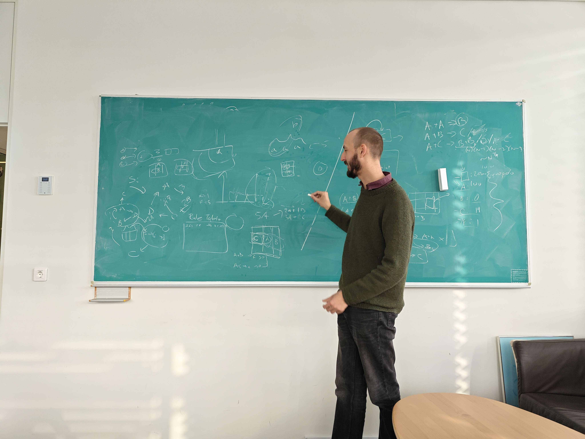

# Arbitrary Chemistry

The origin of life is a problem that remains unsolved to this day. Despite the immense amounts of work being done in biochemistry, it is reasonable to think about it from a physics point of view: what if all reactions were arbitrary: yet, not random? What if the chemical reaction pathways that exist were "evolved" in some way, so as to prevent accumulation of a certain type of waste chemical?

The model we build is abstract, and can be applied to not only chemicals, but also microbial communities. What started as Schauser's idea of a "Riz-like project" ended up being developed in a brainstorming session to a full-blown model.

### Directory structure:

- `docs` contains visualizations, presentations and documentation (if any).
- `src` contains the source code.